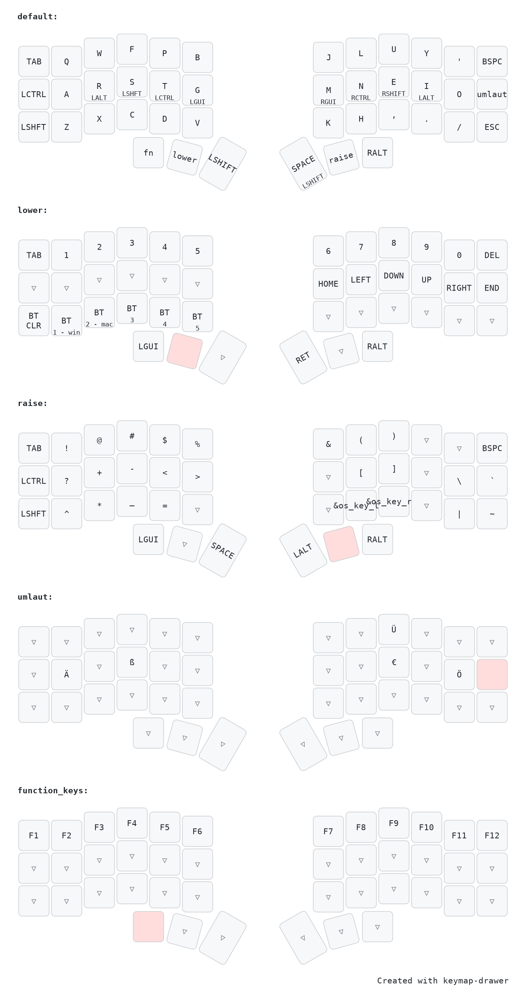

# Misc Urls

## ZMK Modules
### Locale Generator

``` text
This Python module generates localized keyboard layout headers for ZMK using data from the Unicode CLDR or custom layouts in CLDR format.
```

https://github.com/joelspadin/zmk-locale-generator

## Non ZMK
- Keymap Drawer: https://keymap-drawer.streamlit.app/
- https://caksoylar.github.io/keymap-drawer?keymap_yaml=H4sIAAAAAAACA-1U207bQBB95ysWUxhoQ7lfaqlSTTCJwUCwTbmUlrpkERHORY4jFIJ5QHwDT0j8QH-hT_wJX4I9MyQEjKzyQK8v58ye2fGOd8-u5zarjUAVrePy4e6hbH6run5RFXtVvyLDHs9tSr-u9ghRlPtuwwvicFg42hzyGuIG4gJiAZGyi4gm4jriFqICCs2yC1maknUsmqYhtqJ-rIw4UIWpmU7Y1mzS7PzCPdEhMf5ER8yRmFs3OtoyalaXtkJad7FOop037q9jkNpuaBWxUfbcRkB_EfeF0bwutjHYRKSfnEf8iLiEmEeEDCC_pdEIjXSbtyZqFwOveiT9u3UMXsguaFkdI98t1SVGcYdRgPO7TwvG6NswzjzBPMk8xTzNPMM8y_yOeRS6zy_enjk6B8iaumZB-Egfi8ZHpUpCZjwal929hMxEgjaZoE2xZup3B7C6sUK2Iz9aRi7vtMtuLn5kRNCsSVUEvluphymZzsE-p_rfybS92qLUgfSKaTWWnraz7Gc0-AM_97IfPzD3Mb9i7mf-wjzA_Jp5kHkInnqPfv2mwjA3-Z75E_Nn5p0dDr7Cb-dW2OXe3jC3mENiLFVOFLzGymCtVJNDCpeewkNTPbVK5xU0ySsJDmQX0XOt_pXXD64v4YUXPIfUKVcv3NPN2ff0pi7gZ9-p_5k_MXML6MZmEd0KAAA%3D
